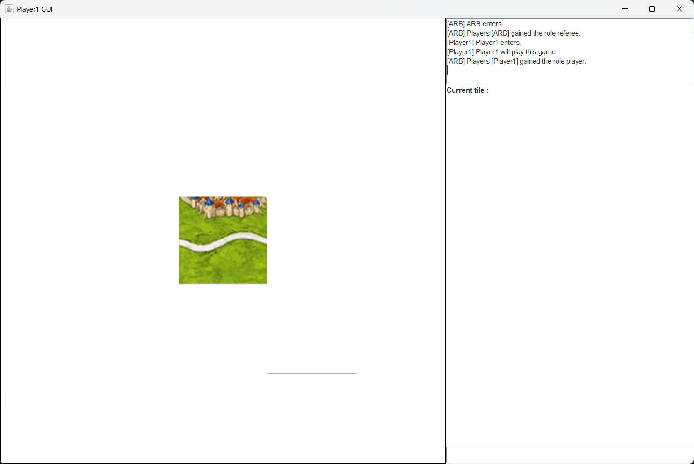
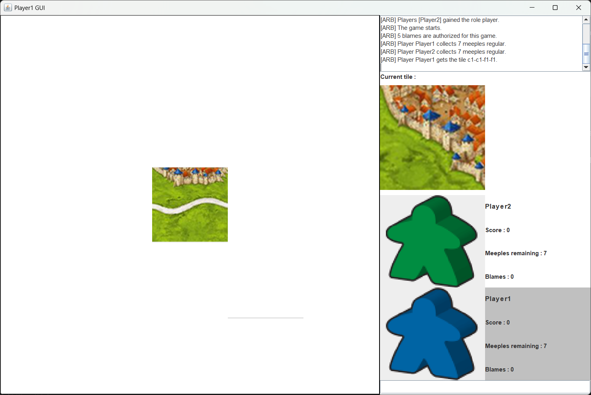
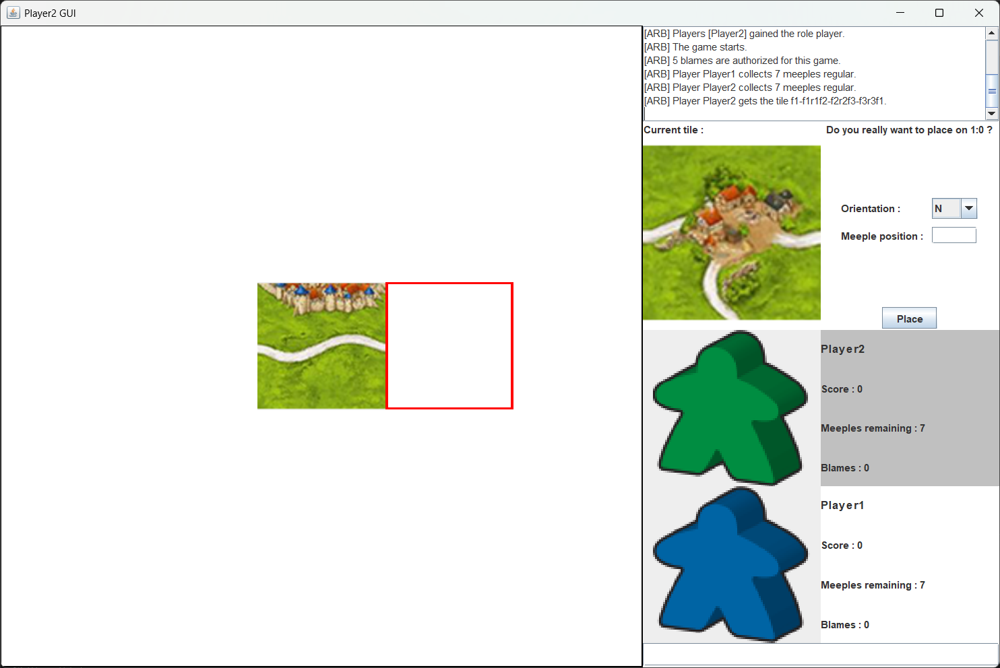
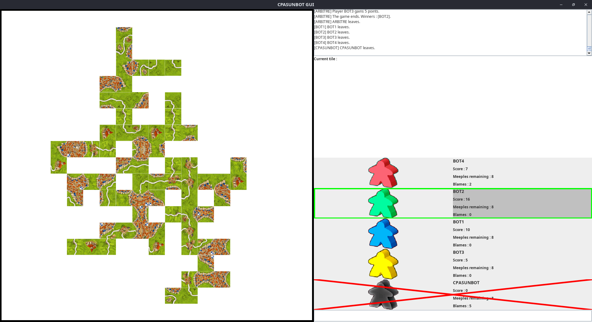

# SwingPlayerGUI

Ce programme est une interface graphique pour jouer à Carcassone.

## Table des matières

- [Installation](#installation)
- [Utilisation](#utilisation)
- [Fonctionnement](#fonctionnement)

## Installation

Se référer à l'installation dans [participant_info](https://github.com/Tom-Taffin/participant_infos_projet_l3).

## Utilisation

Lancer l'interface graphique :

`java -jar PlayerController.jar <Host IP> <Host Port> <Your ID>`

Au démarrage, l'interface graphique ressemblera à ceci :

À gauche se trouve un panneau montrant l'avancée du plateau lors de la partie. En fin de partie, le plateau peut devenir très large et vous aurez peut-être du mal à distinguer les meeples, si c'est le cas vous pouvez zoomer dessus grâce à la molette de votre souris !

À droite se trouvent :
- un panneau indiquant l'historique des messages qui ont été envoyés sur le serveur
- un panneau permettant de placer une tuile (pour le moment inactif)
- un panneau montrant les différents joueurs, leur nombre de meeple restant, leur score et leur nombre de blâme reçu (pour le moment inactif)
- un panneau permettant d'écrire vous-même vos commandes (il est préférable d'utiliser le panneau pour placer les tuiles car il vous assure que vos messages seront bien formés)

Quand tous les joueurs seront arrivés, la partie démarrera et les panneaux inactifs vont s'activer, comme ceci :

Les meeples présents à côté des joueurs vous permettent de connaitre leur couleur. Le joueur dont c'est le tour est coloré en gris, et la tuile se trouvant au dessus est celle que le joueur a pioché.

Au moment de votre tour, vous pourrez appuyer sur une des cases du plateau pour indiquer où vous voulez placer votre tuile. Une bordure rouge viendra se mettre sur la case que vous avez sélectionner, et le panneau sur la droite vous demandera de choisir l'orientation et le meeple, comme ceci :

Référez-vous au fichier [message_carcassonne](https://github.com/Tom-Taffin/participant_infos_projet_l3/blob/master/messages_carcassonne.md) pour comprendre comment placer le meeple à l'endroit que vous voulez sur la tuile. 

La tuile que vous avez pioché se mettra à jour automatiquement en fonction de l'orientation et de la position du meeple que vous choisissez. Par exemple :

Quand vous êtes sûr de votre placement, appuyez sur le bouton *Place* et l'arbitre sera mis au courant de votre coup. Si celui-ci est refusé, l'arbitre vous mettra un blâme, sinon l'arbitre confirmera votre placement et la tuile sera visible sur le plateau.

Voici un exemple de partie terminée. Les joueurs qui ont été banni sont marqués d'une croix et les joueurs ayant gagné la partie sont entourés en vert.

## Fonctionnement

Le programme communique avec un arbitre à l'aide de la librairie [carcassonne_connection_library](https://github.com/Tom-Taffin/carcassonne_connection_library_projet_l3) et met à jour le plateu de jeu à l'aide de [game-elements](https://github.com/Tom-Taffin/game-elements_projet_l3).
